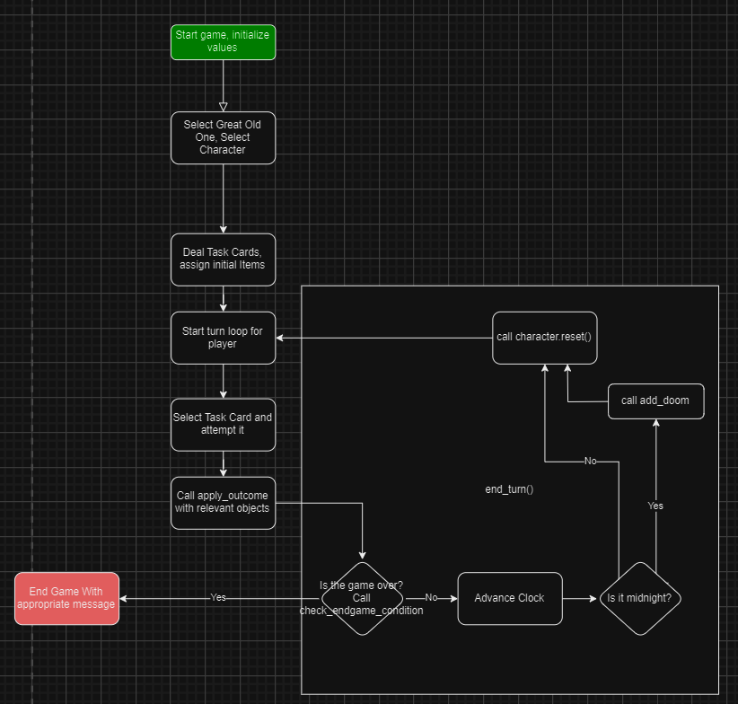
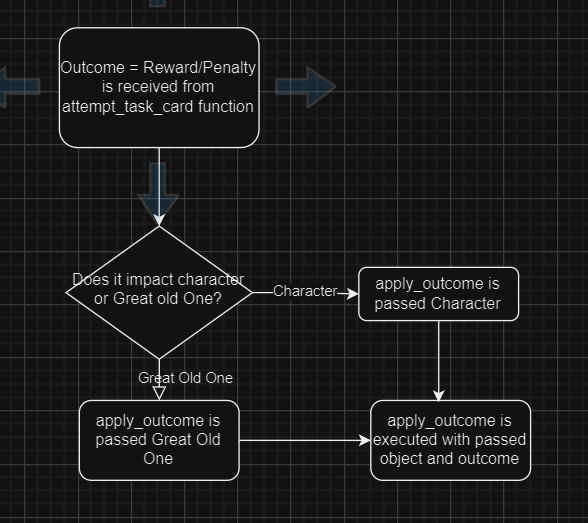
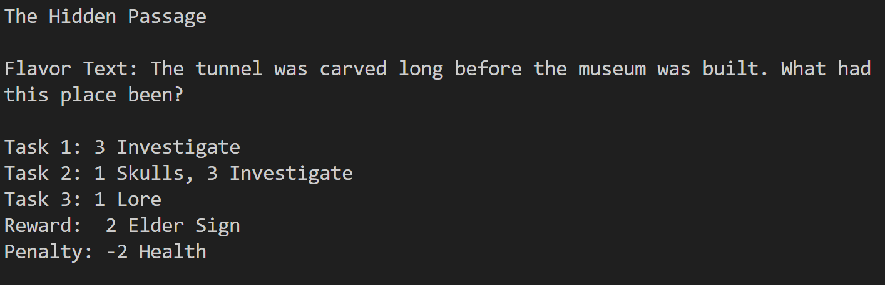
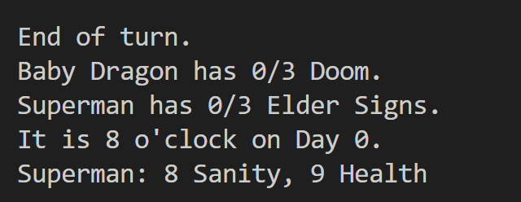
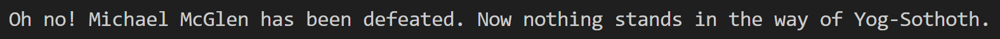
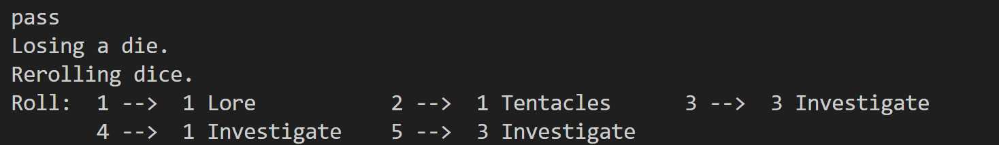
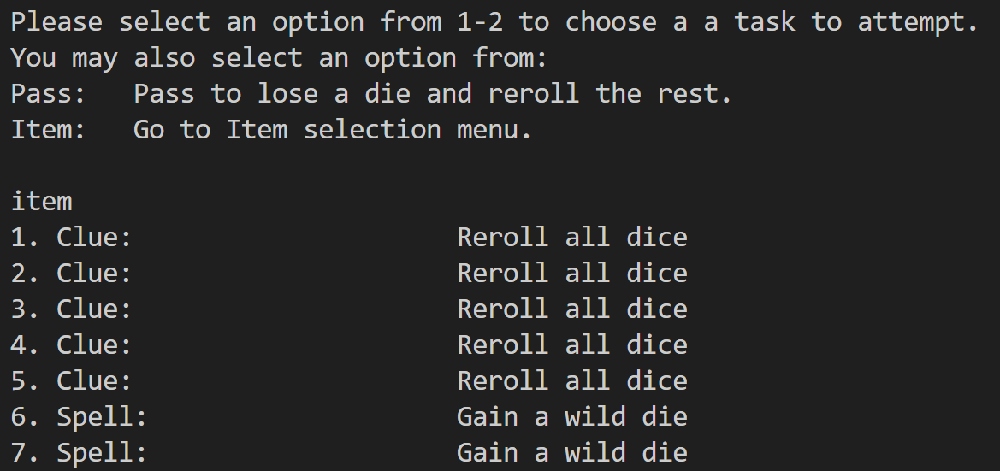
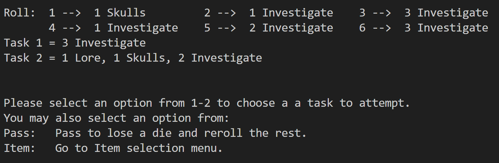
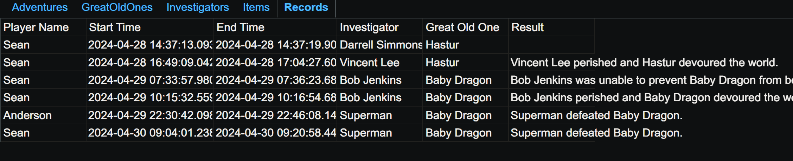

# Chtulu Schmutulu 
### A Dice rolling adventure game
<a href="https://smtilson-pp3-command-line-game-df86354a3a66.herokuapp.com/">"Chtulu Schmtulu"</a> is a dice rolling game based on the board game Elder Sign from Fantasy Flight Games. The game revolves around rolling dice to match symbols on adventure cards. The game is played by entering numbers or commands into the terminal. The goal is to collect the requisite number of Elder Signs before the chosen Great Old One is gains enough Doom to be summoned.

## Table of Contents 
- [Title" src="#title]
- [Introduction" src="#intro]
- [Features" src="#features]
- [Testing" src="#testing]
- [Deployment" src="#deployment]
- [Credits and Outside Sources" src="#credits]

## Introduction 
"Chtulu Schmtulu" is based on the board game Elder Sign from Fantasy Flight Games. The game revolves around rolling dice to match symbols on adventure cards. Completing a card gives you a reward. Failing to complete a card gives you a penalty. The goal is to collect enough Elder Signs, through rewards on cards, to banish the Great Old One before they have been summoned. After every 3 turns, the Great Old one accumulates Doom (Doom can also increase as a result of failing an adventure card). When they have enough Doom, they will be summoned, ending the game in a loss for the player.

### Project description
This is a terminal based text only implementation of a board game. It uses data directly from the board game to create various game objects. It is not a complete implementation in that many aspects of the game have not yet been implemented, which is something we would like to do in the future.

### User Demographics
The expected user is anyone interested in playing a text based terminal game. It helps to understand how dice work. Being familiar with the Chtulu mythos is not necessary, but it will mean that the player is not as deterred by failure.

### Flow Charts
I used draw.io to make flow charts during the development of this project. They were helpful in the planning of the project, structuring of the code, and streamlining the main game play functions. As development progressed, my functions did begin to deviate from these flow charts.

Main game play function:

Apply outcome function:

I found the flow charts very helpful for conceptualizing the main game play loop.

## Instructions
Each game begins with a player entering their name, choosing a Great Old One to battle against, and choosing an Investigator to play as. After that the game begins. Each turn sees a player attempting to complete an Adventure. After the turn ends, in a success or failure, the player will be rewarded or penalized, their dice will be reset, and the clock will advance. If it is midnight, the Great Old One will accrue Doom. Then the game checks to see if any loss conditions or the win condition are satisfied. IF not, the game continues with the player going on another adventure.

#### Winning and Losing
The only way to win is to collect the required amount of Elder Signs in order to banish the chosen Great Old One. This can only be done by completing adventures that have Elder Signs as Rewards. A player will lose if their Health or Sanity is 0 at the end of a turn. A player will also lose if the Great Old One gains enough Doom to be summoned. Doom is gained every 3 turns (at the turns end), when the clock strikes midnight.

A player should decide in advance which Adventures they can afford to fail and which they can not. It is not wise to use all of your items to complete an Adventure unless it will result in winning the game.

Note: The win and loss conditions are only checked at the end of the turn. If a player achieves both, then the win condition takes precedence.

#### Turn Structure
A turn begins with a player going on an Adventure (drawing an Adventure "card") and rolling their dice. Each adventure card has a name, flavor text, tasks, rewards, and penalties. An adventure is completed by completing each task of the Adventure (in any order). If an Adventure is completed, then the player receives the listed award. If the player runs out of dice before completing the adventure then they fail and suffer the penalty. In either case, the turn ends, the game resets for the next round, and the next turn begins.

##### Completing a task
A task on an adventure consists of keywords (which represent symbols) and associated numbers. These keywords occur as faces on the dice. The player has, by default, 6 Green dice. A Green die has the following 6 faces:
1 Investigate, 2 Investigate, 3 Investigate, 1 Lore, 1 Skulls, 1 Tentacles

A player will assign rolled dice from their dice pool to the task in order to fulfill the requirements. For example, suppose the player rolled:
Roll: 1 --> 2 Investigate;   2 --> 1 Skulls;      3 --> 1 Lore
      4 --> 1 Lore;          5 --> 1 Tentacles;   6 --> 1 Investigate
And has the task:
Remaining: 3 Investigate
They would then enter 1 to assign their first die to the task. Their dice pool would then look like:
Roll: 1 --> 1 Skulls;      2 --> 1 Lore           3 --> 1 Lore
      4 --> 1 Tentacles;   5 --> 1 Investigate
Remaining: 1 Investigate
because they assigned there first die to the task. The requirement decreased by 2 since they had 2 Investigate "symbols" on that die face. The die was removed from their pool, and so all die shifted down one. They might then enter 5 to assign their fifth die to the task. This would complete this task and they would have 4 remaining dice to attempt the rest of the tasks for the current Adventure.

Some tasks require a player to lose health or sanity. These effects take place once the task is chosen. The game only checks if the player is alive at the end of the turn, so a player can use an item to recover even if their health or sanity reaches 0 during the turn.

Note: if a player rolls a wild face, then they choose which part of the task to assign it to.

##### Passing
If none of their dice matched the requirements, the player can enter pass. This rerolls all of their dice at the cost of forfeiting one of them. Thus their dice pool decreases. If a player has only one remaining die, and it does not match then they must pass. They will then fail the Adventure as they have no more dice. For example, a player may be in the following situation:
Roll: 1 --> 2 Investigate;   2 --> 1 Skulls;   3 --> 1 Tentacles
      4 --> 1 Investigate
Remaining: 1 Lore
They have no matching symbols and decide to pass. They might then see:
Roll: 1 --> 1 Lore;   2 --> 3 Investigate;   3 --> 1 Investigate
      
Remaining: 1 Lore
Now they can assign their first die and complete the task.

A player can also pass before choosing a task to attempt. The effect is the same, and this may be necessary if they have no matching dice.

##### Items
A player may use an item before choosing a task or assigning a die. There are various items with various effects. Entering item will bring up the item menu. It lists the name and effect of each item. The different possible effects are:

Add a yellow die, Add a red die, Gain 1 Health, Gain 1 Sanity, 
Add a yellow and a red die, Gain a wild die, Reroll all dice, 
Restore Health and Sanity

A yellow die has the following 6 faces:
1 Investigate, 2 Investigate, 3 Investigate, 4 Investigate, 1 Lore, 1 Skulls

A red die has the following 6 faces:
1 Wild, 2 Investigate, 3 Investigate, 4 Investigate, 1 Lore, 1 Skulls

A wild die has all 6 faces 1 Wild.

Each Investigator begins with different collection of starting items that are drawn from the item deck at the start of the game. After an item is used, it is sent to the item_discard. Players gain items by completing adventures. Clues and Spells are considered items but are not in the item_deck. They are unlimited in supply and are not sent to the item_discard.

##### Rewards and Penalties
When an Adventure has all of its tasks completed, the Adventure is complete and the player receives an Award. This can be various items (drawn from the item deck), more Health or Sanity, or an Elder Sign (maybe more than one). These are added to the players inventory. When a player fails an Adventure, by running out of dice, they will suffer the penalty. This can be losing a Clue, the Great Old One gaining more doom, or losing Health or Sanity.
These outcomes are automatically applied and then the turn ends. 

##### End of a Game
Once a game has ended, a record is made of the result. This includes the name the player entered, the start time of the game, the end time of the game, and the result of the game, such as "Vincent Lee perished and Hastur devoured the world."

## Features
The main feature is the game play itself.

### Introduction
The game features an introduction screen with the option to get basic instructions for the game.

### Game selection
The player is able to enter their name, select the Great Old One, and select their Investigator. This is done through a menu that presents the relevant statistics for the individual choices. This data is recorded in a spreadsheet at the games conclusion

### Display of data
The turn begins with the player going on an adventure. They are shown what the tasks are for completing the adventure, as well as what rewards and penalties are associated with the adventure.

When the turn ends, the player is informed of the current game state.

When the game ends, the player is told of the results.

### Moves
There are various moves the player can execute. There is the pass move which rerolls dice at the cost of losing a die. 

There is the possibility to use items (players are brought to an item selection screen). 

The primary move is to assign dice to a task.

### Recording
The results of a completed game are recorded on this <a href="https://docs.google.com/spreadsheets/d/e/2PACX-1vSunyo05f2touIHhqFCUojd-Vq7kQPU-U3iqm4Ti9jvQK8iv-MYz09v5xBIEk94_S_7soxrhHpCQB3a/pubhtml">google spreadsheet</a> on the "Records" page.

### Future

There are many directions that this application can go in the future:
- Different aspects of the original game: monsters, focusing, mythos cards, abilities, multiple players, etc.
- Save ability with distinct users.
- Help menu that can be called at various times.
- More game data, coming from expansions to the original game.
- Replacing the keywords on dice and tasks with actual unicode symbols.

## Testing

### Manual Testing
I manually tested the Python code through use of print statements. Other students, my mentor, my brother, and a friend also used tested the game.

#### Browser Testing
As this project involved an interface that was provided via the Code Institute and we were not to edit it, I did not test the project in different browsers. I have been told that the template does work in Safari.

### Validation
I used Flake8 to validate my code.
I got the following types of notifications:
- trailing whitespace
- blank line contains whitespace
- missing space after ':', ',' and around operators
- import not used or variable not used

I fixed all of these issues. The remaining issues that Flake8 flags are contained in the files from Code Institute that are part of the template and I am explicitly not supposed to edit.

### Bugs
I encountered the following bugs:
- There was an error loading the db_utilities file. The gspread package was throwing an exception.

	Fix: I had replaced all ':' with ': ', and then ':  ' with ': '. This made 'https://' into 'http: //' inside the SCOPE variable. I found this issue using DiffChecker. I removed the space.

- Using a clue was throwing an error.

	Fix: This was because the relevant function still had investigator.reroll() when I had moved the method to the Game object. I changed investigator.reroll() to game.reroll()

- The fit_to_screen function was not working properly for flavor text. 

	Fix: This was because I was calling it once in the construction of the Adventure object and then again when I printed the flavor text. I now only call fit_to_screen when printing the flavor text.

- The draw item function was not drawing certain item types.

	Fix: This was due to some things being capitalized, and others not being capitalized. This the '==' checks were failing. I fixed this by calling lower() when doing the '==' check.

- An exception was being thrown when attempting to parse the Die objects.

	Fix: This was do to a refactor introducing a bank space at the end of some die faces. I fixed this by removing the blank space.

- The penalty for removing clues was not working.

	Fix: This was because the order of effect and item_type were incorrect in the construction of clues (as well as spells.) I fixed this by correcting the order.

- KeyError being thrown when assigning terms to the TRANSLATION dictionary object.

	Fix: This was do to data in the spreadsheet not being normalized. There were typos as well as plural cases I was not accounting for. I fixed this by adding extra key, value pairs to the dictionary, adding redundancy.

- Resetting tasks was not working. 

	Fix: This was because when I defined remaining attr of the Task object it pointed to task.pattern. This meant that when I modified the values of task.remaining it modified those of the task.pattern. I fixed this by copying the pattern dict using a dictionary comprehension.

- I was getting a KeyError in the TRANSLATION dictionary for Elders.

	Fix: It was showing up as a key because I was replacing " Sign" with "" instead of replacing " Signs". I fixed this by first replacing " Signs" with "" and then replacing " Sign" with "".

- Some input completely passed through the attempt_task function.

	Fix: It  was because the validation step at the very beginning of attempt_task needed to be moved. This validation step has since been removed.

- The translate_term function was being passed ' ' and that was throwing a key error.

	Fix: I wasn't applying split to part inside the for loop iterating through parts. I applied the split method to part variable inside the relevant for loop.

- Selecting an already complete task rerolls dice for free.

	Fix: I fixed this by changing where the reroll happens as well as checking if a task is complete before allowing the player to attempt it.

- 'Terror)' was being passed as a key. This was a typo in the spreadsheet.

	Fix: I edited the spreadsheet to remove the typo.

- The whiskey item had the wrong effect.

	Fix: I edited the key for the associated function in ITEM_EFFECT dictionary.

- The draw_item method draws the same item repeatedly.I had not yet started removing the item I was drawing from the item_deck.

	Fix: I started removing the items from the item_deck inside the draw_item method

- Some statements were being reported too often. It looked like:

	  Only 7 more Doom is needed to summon Hastur to this plane of existence.  
	  Only 10 more Elder Signs is needed to banish Hastur and save the world.  
	  Oh no! Vincent Lee has been defeated. Now nothing stands in the way of Hastur.  
	  Only 7 more Doom is needed to summon Hastur to this plane of existence.  
	  Only 10 more Elder Signs is needed to banish Hastur and save the world.  
	  Only 7 more Doom is needed to summon Hastur to this plane of existence.  
	  Only 10 more Elder Signs is needed to banish Hastur and save the world.  
	  Only 7 more Doom is needed to summon Hastur to this plane of existence.  
	  Only 10 more Elder Signs is needed to banish Hastur and save the world.  

	
	Fix: This was because I had print statements inside a property that was being called. It meant that every time I checked a condition the print statement was executing. I fixed this by removing print statements from these properties that are used for checking conditions.

- Entering 'n' still resulted in the printing of the dice instructions. 

	Fix: This was because the condition was not correct. I fixed this by fixing the condition that was being checked.

- An error was being thrown because I was trying to access game.health.

	Fix: I fixed this to game.investigator.health

- A typo was preventing the application from running.

	Fix: There was an unterminated string that was causing this. I terminated the string.

## Deployment

### Setting up APIs
1. Go to <a href="https://console.cloud.google.com/">Google Cloud Platform</a>.
2.  Make sure you are logged into the Google account that you want to associate with this project (as opposed to a work account).
3. Open side navigation bar by clicking on the "burger" icon in the upper left.
4. Click on "select a project" and choose "New Project".
5. Enter a project name and click "Create", and select this new project to go to the project page.
6. Select "APIs & Services" from the menu on the left, and then select Library. We will be enabling the Google Drive API and the Google Sheets API.

#### Google Drive API
If necessary, navigate back to the Dashboard for the current project, click on "APIs & Services" then Library in the menu on the left.

1. Search for the Google Drive API in the search bar. Select it, and then enable it.
2. Click "Create Credentials" in the upper right. Once at the form, select Google Drive API in the "Which API are you using?" dropdown menu. Select Application Data, then click "Next".
3. Choose a name for the Service Account. Specify a Service Account ID if one is not generated from the name. Provide a description for the service, such as "Allow for communication between the app and Google Drive." Then click "Create and Continue".
4. Select Role of Editor and click "Continue".
5. On the "Grant users access to this service account" section, leave it blank and click "Done".
6. Once back at the starting Google Drive API page, scroll down to service accounts and click on the account you have just created.
7. Click on "Keys" in the menu at the top. Click on the "Add Key" dropdown menu and select "Create new Key". In the pop-up menu, select JSON and click "Create".
8. Find the downloaded key in your on your machine (usually in your Downloads folder), its name will begin with the name of the service account it is associated with. 
9. Add it to your local repository, change its name (to creds for example), and then add it to your .gitignore file.

#### Connect to Google Sheets account
1. Go to the credentials file in your local repository. Find the client email and copy it without the quotes.
2. Go to the Google Sheets account and open the Sheet you want to grant access to and click the share button.
3. Paste in the copied email address, make sure editor is selected, untick notify people, and click share.

#### Google Sheets API
If necessary, navigate back to the Dashboard for the current project, click on "APIs & Services" then Library in the menu on the left.
1. Search for the Google Sheets API and select it.
2. Click "Enable".
Note: This API does not require credentials.

### Deploying to Heroku

1. Copy/Clone the <a href="https://github.com/smtilson/pp3-command-line-game" target="_blank">repository</a> on github.
2. Log in to your Heroku account.
3. From the Heroku Dashboard, click the dropdown menu "New" and select "Create new app".
4. Choose a unique name for your app, shoose the appropriate region, and then click "Create app".
5. Go to the "Settings" tab. Scroll to "Config Vars" section anc click "Reveal Config Vars".
6. In field for key, enter "CREDS". In the field for value, paste the contents of your creds.json file which you created in the Google Drive API section above.
7. Add a second Config Var with key "PORT" and value "8000".
8. Scroll down to "Buildpacks". Click "Add buildpack", select "python", and click "Add buildpack".
9. Click "Add buildpack", select "nodejs", and click "Add buildpack".

Note: Make sure that the python buildpack is before the nodejs buildpack. If not, you can reorder them by dragging python to the top.

10. Go to the "Deploy" tab. Scroll down to "Deployment method" and select "GitHub". Search for your repository that you copied/cloned in step 1 above.  Click "Connect" once you have found it.
11. Scroll down to "Manual deploy" and click "Deploy Branch". Once the build is complete, click "View" to be taken to your deployed app.

## References

### Inspiration
The Love Sandwiches walkthrough project was very helpful. The explanation of how to deploy the project, and connect APIs was directly taken from that. I also used what I learned in that project to interact with google spreadsheets with gspread.

During the initial stages of development I looked at lists of single player games. I found Elder Sign on the following <a href="https://www.thegamer.com/best-single-player-solo-board-games/">list</a>.

### Mentor and other people
I got great suggestions from my mentor about important aspects of the project, like implementing an analogue of a "GET" and "POST" method. He also supplied me with examples of readmes from previous projects.

Multiple other people played the game during development. My brother Anderson had helpful suggestions, as did my friend Mike. My fellow students Tarek, Alexander, Hollinda, and Anders had very helpful insights and were very supportive. They found bugs and tested the game.

### Technologies Used
The project was coded in python. 
I used: 
- git and GitHub for version control,
- the python packages gspread, and google-auth-oauthli 
- the Code Institute Template for PP3 for the interface of the deployed project,
- Heroku to host the project,
- <a href="http://www.draw.io">Draw.io</a> for flow charts.
- Flake8 for validation
- IPython for a console/repl

### Technology adjacent references
- <a href="https://www.youtube.com/shorts/cTE0ec3IurE?app=desktop">Ruler in VScode editor</a>
- <a href="https://superuser.com/questions/1468225/is-it-possible-to-detach-the-terminal-window-from-vscode">Open terminal in separate window in VScode</a>
- <a href="https://www.atlassian.com/git/tutorials/syncing/git-pull">git pull and rebase</a>
- <a href="https://www.diffchecker.com/text-compare/">Diff Checker</a>

### StackOverflow and Technical references
- <a href="https://stackoverflow.com/questions/1874592/how-to-write-very-long-string-that-conforms-with-pep8-and-prevent-e501">SO: Long strings that conform to PEP8</a>
- <a href="https://stackoverflow.com/questions/11469025/how-to-implement-a-subscriptable-class-in-python-subscriptable-class-not-subsc">SO: implimenting __getitem__</a>
- <a href="https://stackoverflow.com/questions/44664040/type-hints-with-user-defined-classes">SO: Type hints for user defined classes</a>
- <a href="https://stackoverflow.com/questions/727761/how-to-make-print-call-the-str-method-of-python-objects-inside-a-list">SO: __str__ and __repr__ with Python lists</a>
- <a href="https://stackoverflow.com/questions/38727520/how-do-i-add-default-parameters-to-functions-when-using-type-hinting">SO: Type hinting with default parameters</a>
- <a href="https://stackoverflow.com/questions/4841782/python-constructor-and-default-value">SO: default empty list parameter</a>
- <a href="https://stackoverflow.com/questions/9205081/is-there-a-way-to-store-a-function-in-a-list-or-dictionary-so-that-when-the-inde">SO: storing functions as values in a dict</a>
- <a href="https://stackoverflow.com/questions/24988162/define-functions-with-too-many-arguments-to-abide-by-pep8-standard">SO: too many function arguments and PEP8 compliance</a>
- <a href="https://stackoverflow.com/questions/71427735/how-to-annotate-a-custom-types-iter-to-correctly-indicate-non-uniform-return">SO: type hinting iterators</a>
- <a href="https://www.tutorialspoint.com/How-to-randomly-select-an-item-from-a-tuple-in-Python">Select random element from a tuple</a>

### Non-technical references
- <a href="https://boardgamegeek.com/filepage/120191/elder-sign-all-cards-all-expansions">Spreadsheet of Elder Signs game data</a>
- My version of the above spreadsheet is available in read only form <a href="https://docs.google.com/spreadsheets/d/e/2PACX-1vSunyo05f2touIHhqFCUojd-Vq7kQPU-U3iqm4Ti9jvQK8iv-MYz09v5xBIEk94_S_7soxrhHpCQB3a/pubhtml">here</a>. In contains a subset of the data from the above. It has also been edited in very minor ways
- <a href="https://images-cdn.fantasyflightgames.com/ffg_content/Elder%20Sign/support/Eldersign-rules-of-play.pdf">Elder Signs Official Rulebook</a>
- <a href="https://www.youtube.com/watch?v=Jh4nSpV2n4k">Elder Sign play through from Geek and Sundry</a>

spreadsheet link:

return to TOC